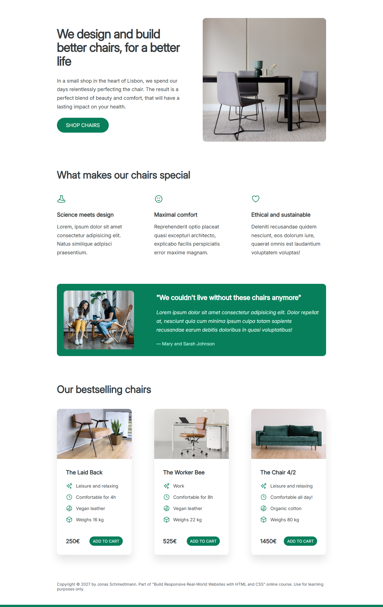

# ChairShop

#### Desciption

This is a practice project to build a website interface in the chapter **_Web Design Rules and Framework_** for the course **Build Responsive Real-World Websites with HTML and CSS** by Jonas Schmedtmann.

#### Technologies Used

- HTML5
- CSS3

#### Result

